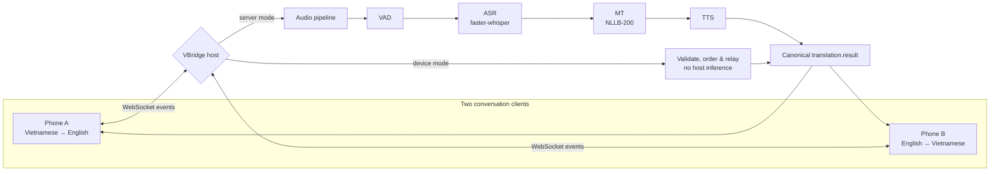
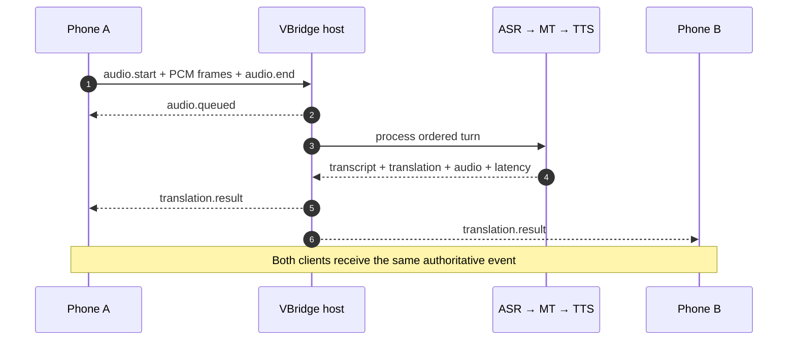

# VBridge

<div align="center">

**A privacy-first, real-time Vietnamese ↔ English meeting interpreter**

Built by **Team SilentVoix** in 48 hours for the
[Vietnam AI Innovation Challenge 2026](https://vietnamaichallenge.com/).

[](https://www.python.org/)
[](https://fastapi.tiangolo.com/)
[](https://react.dev/)
[](https://docs.docker.com/compose/)
[](https://aisingapore.org/)

[Quick start](#quick-start) · [How it works](#how-it-works) · [Two-phone demo](#two-phone-demo) · [API](#api) · [References](#references--acknowledgements)

</div>


VBridge keeps a Vietnamese–English conversation flowing when connectivity is unreliable. The same two-phone experience can run in either of two modes:

- **On-device relay** — each phone performs inference locally; the host only validates and relays results.
- **Server-hosted inference** — phones stream audio to a host running ASR → translation → speech synthesis.

Both paths produce one ordered, authenticated result contract, allowing the system to favor privacy and resilience offline or model capacity online without changing the conversation experience.

> [!NOTE]
> VBridge was created for the 17–19 July 2026, 48-hour Vietnam AI Innovation Challenge. **AI Singapore is a Gold Sponsor and funds the AI Singapore Award with US$5,000 in credits**, connecting standout builders with Singapore's regional AI ecosystem. See the [official challenge page](https://vietnamaichallenge.com/) and [AI Singapore](https://aisingapore.org/).

## What

**VBridge is a two-way Vietnamese ↔ English voice interpreter for live, two-person conversations.** It turns speech into a transcript, translates it, synthesizes the translated speech, and delivers the same ordered result to both participants.

| Mode | Where AI runs | Best when | Host responsibility |
|---|---|---|---|
| **On-device relay** | On each phone | Privacy or unreliable connectivity matters most | Authenticate, validate, order, and relay |
| **Server-hosted inference** | On a local or remote host | More compute and stronger models are available | Run VAD → ASR → MT → TTS and broadcast |

### Product experience

#### Research console

Switch language direction and inference mode, record a turn or stream live audio, then inspect the transcript, translation, synthesized speech, and per-stage latency.


#### Two-phone room

Create a room on one phone, share its six-character code, and join from a second phone with the opposite language direction. The responsive view is designed for push-to-talk conversation.

<p align="center">
  
</p>

## Why

Language access should not disappear with the network, and private conversations should not require sending raw audio to a third-party cloud. VBridge treats offline operation as a reliability and privacy baseline, then adds host inference as an optional quality upgrade.

| Real-world problem | VBridge answer |
|---|---|
| Conversation breaks when the network does | Device mode provides an offline reliability floor |
| Cloud-only speech systems expose sensitive audio | Local inference can keep speech on the phones |
| Small devices cannot always run the strongest models | Host mode unlocks larger ASR and translation models |
| Reconnects and retries can duplicate conversation turns | Signed tokens, event IDs, sequence ordering, and replay-safe results |
| A polished demo can hide pipeline bottlenecks | ASR, MT, TTS, queue, and end-to-end latency are observable |
| Southeast Asian languages are often secondary benchmarks | Vietnamese ↔ English is the primary product path and evaluation target |

## How it works

### Hybrid architecture



### One turn, delivered once



In **device mode**, the phone sends an already-computed `translation.result`; the host skips the pipeline and relays the validated event to both participants.

### Technology

| Layer | Implementation |
|---|---|
| Web client | React, TypeScript, Vite, Tailwind CSS |
| API and realtime transport | FastAPI, REST, WebSockets |
| Speech recognition | [faster-whisper](https://github.com/SYSTRAN/faster-whisper), default model `Systran/faster-whisper-base` |
| Machine translation | [NLLB-200](https://huggingface.co/facebook/nllb-200-distilled-600M), distilled 600M checkpoint |
| Voice activity detection | [Silero VAD](https://github.com/snakers4/silero-vad) or energy-based fallback |
| Speech synthesis | Pluggable TTS contract; mock implementation included |
| Packaging | Docker Compose; optional CUDA override |
| Quality | pytest, Ruff, TypeScript, ESLint |

### Quick start

#### Full inference stack

You need [Docker with Compose](https://docs.docker.com/compose/install/). The default CPU stack downloads roughly 2.5 GB of model weights into a persistent `hf-cache` volume on first use.

```bash
git clone <your-repository-url>
cd VBridge
docker compose up --build
```

Open:

- Web app: <http://localhost:5173>
- API: <http://localhost:8000>
- Interactive OpenAPI docs: <http://localhost:8000/docs>

#### Fast mock demo

Use this mode to explore the complete product and transport flow without downloading models.

**PowerShell**

```powershell
$env:VBRIDGE_EXTRAS=""
$env:VBRIDGE_ASR_MODE="mock"
$env:VBRIDGE_MT_MODE="mock"
$env:VBRIDGE_VAD_MODE="energy"
docker compose up --build
```

**Bash**

```bash
VBRIDGE_EXTRAS= VBRIDGE_ASR_MODE=mock VBRIDGE_MT_MODE=mock \
VBRIDGE_VAD_MODE=energy docker compose up --build
```

#### Local development

```powershell
# API — terminal 1
python -m venv .venv
.venv\Scripts\Activate.ps1
pip install -e ".[dev]"
uvicorn apps.api.main:app --reload

# Web — terminal 2
cd apps/web
npm install
npm run dev
```

### Two-phone demo

1. Open <http://localhost:5173/#/room> in two tabs or on two phones.
2. On Phone A, select **Server Host** or **On-Device**, then create a room.
3. On Phone B, select **Join** and enter Phone A's six-character room code.
4. Hold the talk button, speak, and release to send the turn.
5. Confirm that both screens receive the same translated result.

For physical phones on the same LAN, build the web client with the host machine's reachable IP:

```bash
VITE_API_URL=http://192.168.1.10:8000 docker compose up --build
```

> [!IMPORTANT]
> Room state is currently process-local. Keep `VBRIDGE_API_WORKERS=1`. Production startup also requires a private `VBRIDGE_ROOM_TOKEN_SECRET`; the built-in development secret is rejected.

### API

#### Core pipeline

| Method | Route | Purpose |
|---|---|---|
| `GET` | `/health` | Service health |
| `GET` | `/metrics` | Average stage and total latency |
| `POST` | `/asr` | Speech recognition |
| `POST` | `/translation` | Vietnamese ↔ English translation |
| `POST` | `/tts` | Speech synthesis |
| `POST` | `/pipeline/upload` | Upload and process a complete audio turn |
| `WS` | `/pipeline/stream` | Stream PCM audio and receive partial/final events |

#### Conversation rooms

| Method | Route | Purpose |
|---|---|---|
| `POST` | `/rooms` | Create a two-participant room |
| `POST` | `/rooms/join` | Join with a six-character code |
| `GET` | `/rooms/{room_id}` | Recover authenticated room state |
| `DELETE` | `/rooms/{room_id}` | Close a room as its creator |
| `WS` | `/ws/rooms/{room_id}?token=…` | Exchange ordered room events and audio |

The room protocol guards against duplicate event IDs and out-of-order sequences, supports authenticated reconnection, limits turn size and duration, and queues completed turns without blocking ping or subsequent uploads. Explore the exact schemas in the running [OpenAPI documentation](http://localhost:8000/docs).

### Evaluation

The repository includes repeatable model-selection and robustness tooling rather than presenting a single benchmark as universal performance:

```powershell
pip install -e ".[audio,asr,mt,vad,eval,dev]"
$env:VBRIDGE_ASR_MODE="real"
$env:VBRIDGE_MT_MODE="real"
$env:VBRIDGE_VAD_MODE="silero"
python scripts/eval/run.py --asr-mode real --mt-mode real
```


Results depend on hardware, audio conditions, model checkpoint, and dataset. The checked-in CPU measurements are engineering evidence for model selection and wiring; rerun them on the target deployment before making production claims.

### Project map

```text
VBridge/
├── apps/
│   ├── api/                 # FastAPI application and endpoints
│   ├── web/                 # React research and room clients
│   └── android-pol/         # Android proof-of-concept
├── services/                # ASR, MT, TTS, VAD, pipeline, room services
├── shared/                  # Contracts, configuration, logging, metrics
├── scripts/                 # Evaluation and demo helpers
├── dataset/                 # Evaluation dialogues and fixtures
├── tests/                   # Unit and integration tests
├── docs/                    # Design notes, requirements, and images
└── docker/                  # API and web container definitions
```

### Quality checks

```bash
ruff check .
pytest
cd apps/web && npm run build && npm run lint
docker compose build
```

## Checklist

Use this as the build, demo, and judging checklist.

### Product

- [x] Vietnamese → English conversation path
- [x] English → Vietnamese conversation path
- [x] Two participants receive one authoritative result
- [x] Six-character room creation and joining flow
- [x] Responsive push-to-talk web experience
- [x] On-device relay and server-hosted modes share one contract
- [ ] Native mobile models replace the current browser device-mode stand-in

### Engineering

- [x] VAD → ASR → MT → TTS pipeline boundaries
- [x] REST and WebSocket interfaces
- [x] Authenticated, room-bound access tokens
- [x] Duplicate-event and out-of-order protection
- [x] Reconnection and bounded turn queues
- [x] Per-stage and end-to-end latency metrics
- [x] Docker Compose deployment and CUDA override
- [ ] Persistent room state for multi-worker scaling

### Evidence for the demo

- [x] Real UI screenshots captured with Playwright
- [x] Repeatable ASR/MT evaluation scripts and checked-in results
- [x] Architecture and event-flow diagrams
- [x] Interactive OpenAPI documentation
- [x] Mock mode for a fast, deterministic product walkthrough
- [ ] Target-device benchmark for quantized on-device models
- [ ] User study with Vietnamese accents and noisy real-world rooms

## Questions AI Singapore may ask

The challenge does not publish a project-specific interview script. These are the strongest questions to prepare for based on VBridge's technical claims, regional relevance, and the AI Singapore Award—and the evidence already available in this repository.

| Likely question | Answer through VBridge | Evidence to show |
|---|---|---|
| **What concrete problem are you solving?** | Two people who do not share a language need a private interpreter that continues working with poor or absent connectivity. | Run the two-phone demo and switch between device and server modes. |
| **Why is this relevant to Southeast Asia?** | The first production path is Vietnamese ↔ English, addressing a major regional language while supporting cross-border work, education, travel, and public services. | Show the language-direction control, Vietnamese dialogue fixtures, and evaluation tooling. |
| **What is technically novel beyond chaining models?** | Both decentralized and hosted inference obey one authenticated, ordered conversation protocol. The transport can change without changing the user experience or result contract. | Walk through the hybrid Mermaid diagram and the `translation.result` event. |
| **Does “offline” really mean offline?** | The protocol and relay design do; the current browser demo uses a server call as an explicitly documented stand-in for native on-device models. Full offline inference is the next implementation milestone. | Point to the device-mode implementation comments, architecture diagram, and unchecked native-model checklist item. |
| **How do you protect privacy?** | Device mode is designed to keep raw audio on the phones. Room access is token-bound, turns are ordered, and the relay accepts finished results instead of audio. | Demonstrate device mode and inspect the room authentication contract. |
| **How do you know translation quality is good?** | VBridge ships evaluation scripts and artifacts, states the test conditions, and avoids treating one score as universal performance. | Run `scripts/eval/run.py`; show `vbridge_mt_evaluation.csv` and the robustness chart. |
| **How do you handle noisy, real conversations?** | The pipeline includes VAD, streaming turn boundaries, queueing, and ASR robustness experiments across noise levels. | Show Silero VAD configuration and `chart_model_comparison.png`. |
| **Can it scale beyond a hackathon demo?** | The API, model services, contracts, containers, health checks, and metrics are deployment-shaped. Process-local room state is clearly identified as the next scaling boundary. | Open `/docs`, `/health`, `/metrics`, and explain the single-worker constraint. |
| **Why should AI Singapore support this project?** | VBridge is a practical bridge between Vietnam and Singapore: regional language technology, privacy-aware deployment, and measurable pathways from prototype to field testing. AI Singapore can accelerate on-device optimization, regional evaluation, and ecosystem access. | Present the roadmap and a proposed Vietnam–Singapore pilot. |
| **Where could SEA-LION contribute?** | SEA-LION is not currently presented as an implemented dependency. It is a strong candidate for contextual correction, terminology handling, multilingual expansion, and regional evaluation—subject to latency and device-fit benchmarks. | Propose an A/B evaluation against the current NLLB translation path; do not claim integration before it exists. |
| **What would you do with the AI Singapore Award?** | Benchmark a SEA-LION-assisted translation path, quantize the on-device stack, expand Vietnamese accent/noise datasets, and run a two-country pilot with reproducible quality and latency reports. | Tie each work package to an unchecked checklist item and a measurable acceptance target. |

### A crisp 60-second answer

> VBridge is a privacy-first Vietnamese–English meeting interpreter. It works in two modes: phones can infer locally while a host only relays results, or a host can run stronger speech and translation models when compute is available. The innovation is not simply ASR plus translation—it is one authenticated, ordered conversation contract that works across both deployment modes. We can demonstrate it on two phones, measure every pipeline stage, and reproduce our evaluation. With AI Singapore's support, we would benchmark SEA-LION for regional language improvement, complete quantized native inference, and validate the system in a Vietnam–Singapore pilot.

## Roadmap

- Replace the browser device-mode stand-in with quantized native on-device ASR, MT, and TTS.
- Persist rooms, replay state, and queues for safe multi-worker deployment.
- Add speaker diarization, domain glossary controls, and broader Vietnamese accent evaluation.
- Package the Android client and automate two-device end-to-end tests.

## References & acknowledgements

VBridge stands on open research and a regional innovation community:

- [Vietnam AI Innovation Challenge 2026](https://vietnamaichallenge.com/) — official event, award, sponsor, and organizer information.
- [AI Singapore](https://aisingapore.org/) — Gold Sponsor of VAIC 2026 and sponsor of the AI Singapore Award; a national AI programme supported by Singapore's National Research Foundation and hosted by the National University of Singapore.
- [SEA-LION](https://sea-lion.ai/) — AI Singapore's open, Southeast Asia–focused language model initiative and an important reference for inclusive regional AI.
- [National Innovation Center, Vietnam](https://nic.gov.vn/) — co-organizer and home of Vietnam's national innovation ecosystem.
- [AI for Vietnam Foundation](https://aiforvietnam.org/) — challenge co-organizer and builder community.
- [faster-whisper](https://github.com/SYSTRAN/faster-whisper) and the [Whisper paper](https://arxiv.org/abs/2212.04356) — efficient speech recognition and its research foundation.
- [NLLB-200](https://ai.meta.com/research/no-language-left-behind/) and the [NLLB paper](https://arxiv.org/abs/2207.04672) — multilingual machine translation research.
- [Silero VAD](https://github.com/snakers4/silero-vad) — voice activity detection used by the real pipeline.

<div align="center">

Built with care by **Team SilentVoix** · Vietnam ↔ Singapore · 2026

</div>
