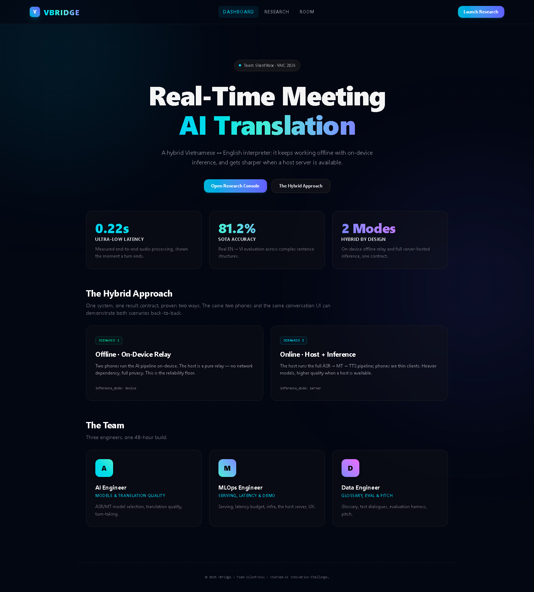
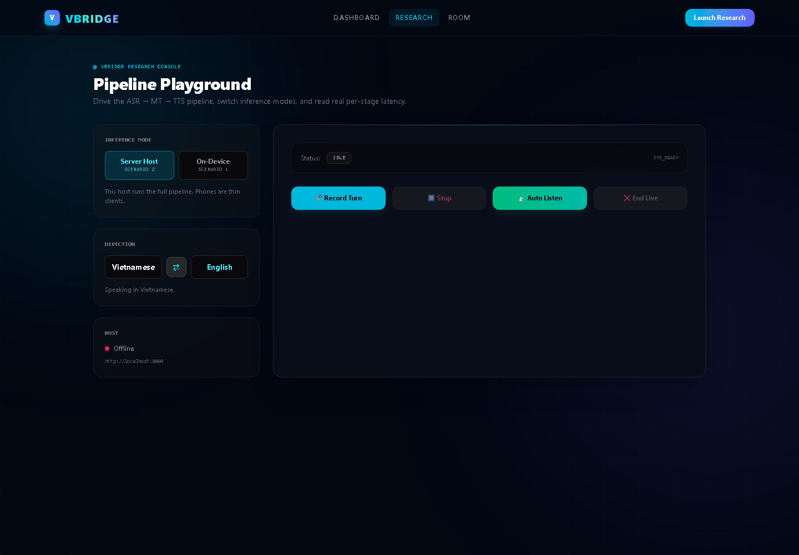
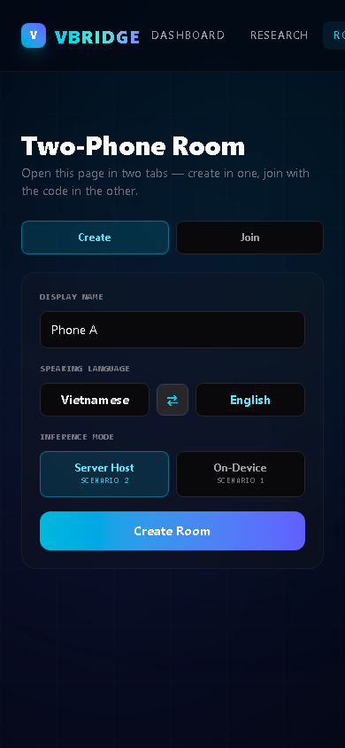
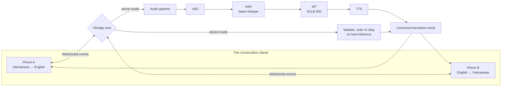
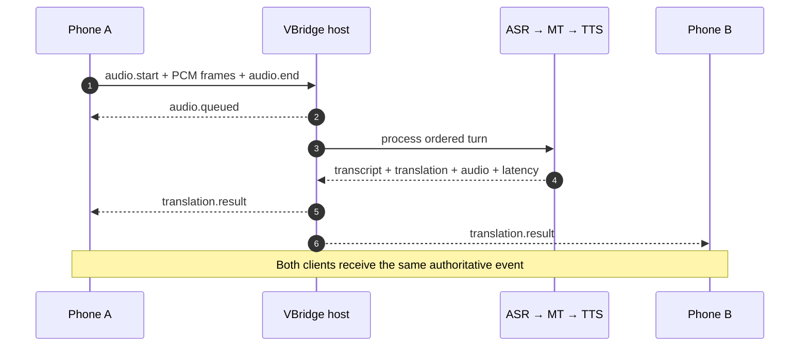
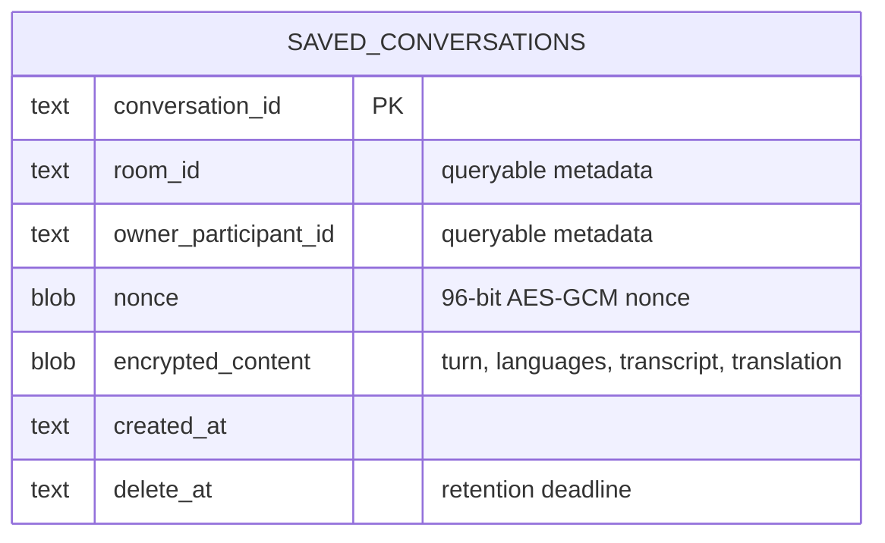
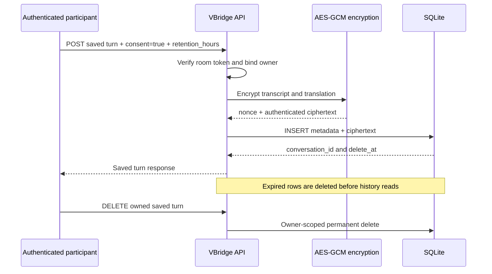
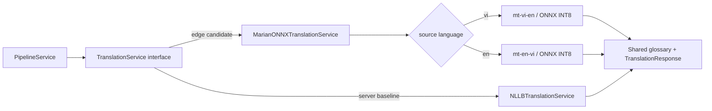
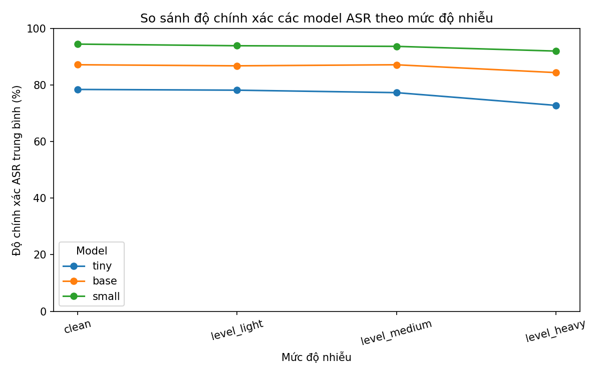

# VBridge

<div align="center">

**A privacy-first, real-time Vietnamese ↔ English meeting interpreter**

Built by **Team SilentVoix** in 48 hours for the
[Vietnam AI Innovation Challenge 2026](https://vietnamaichallenge.com/).

[](https://www.python.org/)
[](https://fastapi.tiangolo.com/)
[](https://react.dev/)
[](https://docs.docker.com/compose/)
[](https://aisingapore.org/)

[Quick start](#quick-start) · [How it works](#how-it-works) · [Two-phone demo](#two-phone-demo) · [API](#api) · [References](#references--acknowledgements)

</div>



VBridge keeps a Vietnamese–English conversation flowing when connectivity is unreliable. The same two-phone experience can run in either of two modes:

- **On-device relay** — each phone performs inference locally; the host only validates and relays results.
- **Server-hosted inference** — phones stream audio to a host running ASR → translation → speech synthesis.

Both paths produce one ordered, authenticated result contract, allowing the system to favor privacy and resilience offline or model capacity online without changing the conversation experience.

> [!NOTE]
> VBridge was created for the 17–19 July 2026 Vietnam AI Innovation Challenge in response to the **Real-Time Vietnamese-English Business Meeting Translator Challenge, sponsored by AI Singapore**. The brief calls for a live, bidirectional, near-real-time meeting translator and offers the winner prize money plus a sponsored 1–2 month visiting researcher experience at AI Singapore's office at Nanyang Technological University.

## What

**VBridge is a two-way Vietnamese ↔ English voice interpreter for live, two-person conversations.** It turns speech into a transcript, translates it, synthesizes the translated speech, and delivers the same ordered result to both participants.

| Mode | Where AI runs | Best when | Host responsibility |
|---|---|---|---|
| **On-device relay** | On each phone | Privacy or unreliable connectivity matters most | Authenticate, validate, order, and relay |
| **Server-hosted inference** | On a local or remote host | More compute and stronger models are available | Run VAD → ASR → MT → TTS and broadcast |

### Product experience

#### Research console

Switch language direction and inference mode, record a turn or stream live audio, then inspect the transcript, translation, synthesized speech, and per-stage latency.



#### Two-phone room

Create a room on one phone, share its six-character code, and join from a second phone with the opposite language direction. The responsive view is designed for push-to-talk conversation.

<p align="center">
  
</p>

## Why

Language access should not disappear with the network, and private conversations should not require sending raw audio to a third-party cloud. VBridge treats offline operation as a reliability and privacy baseline, then adds host inference as an optional quality upgrade.

| Real-world problem | VBridge answer |
|---|---|
| Conversation breaks when the network does | Device mode provides an offline reliability floor |
| Cloud-only speech systems expose sensitive audio | Local inference can keep speech on the phones |
| Small devices cannot always run the strongest models | Host mode unlocks larger ASR and translation models |
| Reconnects and retries can duplicate conversation turns | Signed tokens, event IDs, sequence ordering, and replay-safe results |
| A polished demo can hide pipeline bottlenecks | ASR, MT, TTS, queue, and end-to-end latency are observable |
| Southeast Asian languages are often secondary benchmarks | Vietnamese ↔ English is the primary product path and evaluation target |

## How it works

### Hybrid architecture



### One turn, delivered once



In **device mode**, the phone sends an already-computed `translation.result`; the host skips the pipeline and relays the validated event to both participants.

### Optional encrypted conversation history

Conversation persistence is **off by default**. A participant must explicitly submit
`consent: true` for each turn they choose to save. VBridge stores only an encrypted JSON payload;
room and owner identifiers plus retention timestamps remain queryable so ownership and automatic
deletion can be enforced. Audio is never written to this database.





SQLite indexes support `(owner_participant_id, created_at DESC)` history reads and `delete_at`
retention cleanup. Production requires an independent
`VBRIDGE_CONVERSATION_ENCRYPTION_KEY`; rotating it without re-encryption makes existing records
unreadable. This database is deliberately not used for room coordination, so the API must still run
with one worker until room state moves to shared storage.

### Technology

| Layer | Implementation |
|---|---|
| Web client | React, TypeScript, Vite, Tailwind CSS |
| API and realtime transport | FastAPI, REST, WebSockets |
| Speech recognition | [faster-whisper](https://github.com/SYSTRAN/faster-whisper), default model `Systran/faster-whisper-base` |
| Machine translation | [NLLB-200](https://huggingface.co/facebook/nllb-200-distilled-600M), distilled 600M checkpoint |
| Voice activity detection | [Silero VAD](https://github.com/snakers4/silero-vad) or energy-based fallback |
| Speech synthesis | Pluggable TTS contract; mock implementation included |
| Packaging | Docker Compose; optional CUDA override |
| Quality | pytest, Ruff, TypeScript, ESLint |

### Distilled and edge MT models

#### What

VBridge currently has two distinct MT model tracks:

| Track | Artifact | Role today | Provenance we can verify |
|---|---|---|---|
| **Server baseline** | `facebook/nllb-200-distilled-600M` | Active real-mode translation service | A multilingual checkpoint distilled and published by Meta; it was **not** distilled by Team SilentVoix |
| **Edge candidate** | `distilled/mt-vi-en/onnx_int8` and `distilled/mt-en-vi/onnx_int8` | Local direction-specific ONNX packages, not yet wired into the VBridge pipeline | MarianMT architecture, six encoder and six decoder layers, INT8 ONNX quantization, separate Vietnamese → English and English → Vietnamese tokenizers |

The local folder name `distilled/` does not by itself establish that the team performed knowledge distillation. The checked-in metadata proves ONNX export and INT8 quantization from FP32 artifacts, but the repository does not yet contain the training code, teacher outputs, dataset manifest, base checkpoint identifier, hyperparameters, or training logs needed to reproduce a team fine-tune or distillation run.

> [!IMPORTANT]
> **Quantization and distillation are different.** Quantization stores computations at lower precision to reduce memory and often improve CPU/edge latency. Knowledge distillation trains a smaller student to reproduce a teacher's behavior. Until the missing training provenance is added, describe these artifacts as **team-prepared, direction-specific MarianMT ONNX INT8 edge models**, not “self-trained distilled models.”

#### Why

NLLB is the quality-oriented multilingual server baseline, while the smaller direction-specific Marian models are candidates for the edge-device bonus. The decision should be evidence-based: an edge model is useful only if its reductions in size, RAM, and latency outweigh any loss in meaning, terminology, names, numbers, and robustness.

#### How the team-trained claim becomes reproducible

If these Marian checkpoints were fine-tuned or distilled by the team, add the following before making that claim in the demo:

- [ ] Base model repository and immutable revision/hash
- [ ] Licensed training-data manifest, source, cleaning steps, and sample counts by direction
- [ ] Fixed train, validation, and untouched test splits with leakage checks
- [ ] Fine-tuning and/or teacher–student distillation script
- [ ] Teacher model, temperature, loss composition, optimizer, learning rate, epochs, seed, and hardware
- [ ] FP32 checkpoint metrics before ONNX export
- [ ] Export and INT8 quantization command with tool versions
- [ ] Model card covering intended use, limitations, licenses, and known failure cases
- [ ] Artifact hashes or a versioned model release so another person can reproduce the benchmark

#### How to put it into VBridge

The pipeline already depends on the abstract `TranslationService`, so the edge model belongs behind a new ONNX implementation rather than inside the room or API code.



The ONNX adapter should:

1. Load both local model/tokenizer directories once at startup with ONNX Runtime.
2. Select `mt-vi-en` or `mt-en-vi` from `request.source_language`.
3. Tokenize, generate with a fixed and documented beam configuration, and decode.
4. Apply the same glossary post-processing used by NLLB.
5. Return the existing `TranslationResponse`, including measured `processing_ms`.
6. Expose the selected model name and backend through `/metrics`.
7. Add an explicit mode such as `VBRIDGE_MT_MODE=onnx`; do not silently replace the NLLB baseline.

This is the intended integration contract, not a claim that the ONNX adapter is already implemented.

#### How to evaluate it against other MT models

Compare models on the **same frozen test set**, on the **same hardware**, with identical text normalization and decoding rules. Report Vietnamese → English and English → Vietnamese separately; a single average can hide a weak direction.

| Dimension | Required measurement | Why it matters |
|---|---|---|
| General translation quality | sacreBLEU signature and chrF++ | Reproducible lexical and character-level comparison |
| Meaning preservation | COMET or human adequacy score | Captures semantic quality that BLEU can miss |
| Business fidelity | Exact-match rates for names, companies, numbers, dates, units, and glossary terms | Directly targets the challenge's meeting scenario |
| Speed | Cold start plus warm p50/p95 latency, sentences/second | Separates initialization cost from conversation responsiveness |
| Edge fit | On-disk size, peak RAM, and CPU utilization | Tests whether the model is genuinely deployable on a small device |
| Robust pipeline quality | ASR → MT score on clean and noisy recorded speech | Measures error propagation in the product, not only clean-text MT |
| Reliability | Empty output, hallucination, wrong-language, and truncation rates | Makes failure modes visible |

Use at least these comparison rows:

1. Current NLLB-200 distilled 600M server baseline.
2. Team-prepared MarianMT FP32 parent checkpoint, if it can be recovered and versioned.
3. Team-prepared MarianMT ONNX INT8 artifact.
4. The original public Marian baseline at a pinned revision.
5. Any future SEA-LION-assisted approach as a separately labelled experiment, not as an existing dependency.

Evaluate MT twice: first with gold reference text to isolate translation quality, then with real ASR transcripts to measure end-to-end meeting performance. Publish per-sentence outputs and paired differences—not only aggregate scores—so judges can inspect where the smaller model wins or fails.

### Quick start

#### Lightweight relay stack

You need [Docker with Compose](https://docs.docker.com/compose/install/). The default image is intentionally small: it runs rooms, authentication, encrypted history, device relay, and mock pipeline checks without installing PyTorch or downloading models.

```bash
git clone <your-repository-url>
cd VBridge
docker compose up --build
```

Open:

- Web app: <http://localhost:5173>
- API: <http://localhost:8000>
- Interactive OpenAPI docs: <http://localhost:8000/docs>

#### CPU inference stack

The inference override swaps only the API image while preserving the same service name, proxy,
ports, room contract, database, and volumes. Model weights download on first initialization and stay
in the persistent `hf-cache` volume.

```powershell
docker compose -f docker-compose.yml -f docker-compose.inference.yml build api
docker compose -f docker-compose.yml -f docker-compose.inference.yml up -d
```

#### CUDA inference stack

This path requires Docker's NVIDIA runtime and a compatible NVIDIA driver:

```powershell
docker compose `
  -f docker-compose.yml `
  -f docker-compose.inference.yml `
  -f docker-compose.cuda.yml `
  build api

docker compose `
  -f docker-compose.yml `
  -f docker-compose.inference.yml `
  -f docker-compose.cuda.yml `
  up -d
```

The packaging roles are explicit: `docker/api.Dockerfile` is the lightweight control plane,
`docker/inference.Dockerfile` adds the CPU model stack, and
`docker/inference.cuda.Dockerfile` adds the CUDA/cuDNN runtime and CUDA PyTorch wheels.

#### Local development

```powershell
# API — terminal 1
python -m venv .venv
.venv\Scripts\Activate.ps1
pip install -e ".[dev]"
uvicorn apps.api.main:app --reload

# Web — terminal 2
cd apps/web
npm install
npm run dev
```

### Two-phone demo

1. Open <http://localhost:5173/#/room> in two tabs or on two phones.
2. On Phone A, select **Server Host** or **On-Device**, then create a room.
3. On Phone B, select **Join** and enter Phone A's six-character room code.
4. Hold the talk button, speak, and release to send the turn.
5. Confirm that both screens receive the same translated result.

For physical phones on the same LAN, build the web client with the host machine's reachable IP:

```bash
VITE_API_URL=http://192.168.1.10:8000 docker compose up --build
```

> [!IMPORTANT]
> Room state is currently process-local. Keep `VBRIDGE_API_WORKERS=1`. Production startup also requires a private `VBRIDGE_ROOM_TOKEN_SECRET`; the built-in development secret is rejected.

### API

#### Core pipeline

| Method | Route | Purpose |
|---|---|---|
| `GET` | `/health` | Service health |
| `GET` | `/metrics` | Average stage and total latency |
| `GET` | `/metrics/prometheus` | Prometheus-compatible load and inference metrics |
| `POST` | `/rooms/{room_id}/conversations` | Explicitly save one encrypted translated turn |
| `GET` | `/rooms/{room_id}/conversations` | List the authenticated participant's saved turns |
| `DELETE` | `/rooms/{room_id}/conversations/{conversation_id}` | Permanently delete an owned saved turn |
| `POST` | `/asr` | Speech recognition |
| `POST` | `/translation` | Vietnamese ↔ English translation |
| `POST` | `/tts` | Speech synthesis |
| `POST` | `/pipeline/upload` | Upload and process a complete audio turn |
| `WS` | `/pipeline/stream` | Stream PCM audio and receive partial/final events |

#### Conversation rooms

| Method | Route | Purpose |
|---|---|---|
| `POST` | `/rooms` | Create a two-participant room |
| `POST` | `/rooms/join` | Join with a six-character code |
| `GET` | `/rooms/{room_id}` | Recover authenticated room state |
| `DELETE` | `/rooms/{room_id}` | Close a room as its creator |
| `WS` | `/ws/rooms/{room_id}?token=…` | Exchange ordered room events and audio |

The room protocol guards against duplicate event IDs and out-of-order sequences, supports authenticated reconnection, limits turn size and duration, and queues completed turns without blocking ping or subsequent uploads. Explore the exact schemas in the running [OpenAPI documentation](http://localhost:8000/docs).

### Evaluation

The repository includes repeatable model-selection and robustness tooling rather than presenting a single benchmark as universal performance:

```powershell
pip install -e ".[audio,asr,mt,vad,eval,dev]"
$env:VBRIDGE_ASR_MODE="real"
$env:VBRIDGE_MT_MODE="real"
$env:VBRIDGE_VAD_MODE="silero"
python scripts/eval/run.py --asr-mode real --mt-mode real
```



Results depend on hardware, audio conditions, model checkpoint, and dataset. The checked-in CPU measurements are engineering evidence for model selection and wiring; rerun them on the target deployment before making production claims.

### Project map

```text
VBridge/
├── apps/
│   ├── api/                 # FastAPI application and endpoints
│   ├── web/                 # React research and room clients
│   └── android-pol/         # Android proof-of-concept
├── services/                # ASR, MT, TTS, VAD, pipeline, room services
├── shared/                  # Contracts, configuration, logging, metrics
├── scripts/                 # Evaluation and demo helpers
├── dataset/                 # Evaluation dialogues and fixtures
├── tests/                   # Unit and integration tests
├── docs/                    # Design notes, requirements, and images
└── docker/                  # API and web container definitions
```

### Quality checks

```bash
ruff check .
pytest
cd apps/web && npm run build && npm run lint
docker compose build
docker compose -f docker-compose.yml -f docker-compose.inference.yml build api
```

## AI Singapore challenge checklist

This checklist follows the supplied **Real-Time Vietnamese-English Business Meeting Translator Challenge** brief. Status reflects what can be demonstrated from this repository today.

### Core requirements

| Status | Requirement from the brief | VBridge answer and demo evidence |
|:---:|---|---|
| ✅ | Functional prototype built during the two-day hackathon | The web app, FastAPI service, Docker deployment, and two-phone room form a working end-to-end prototype. |
| ✅ | Bidirectional Vietnamese ↔ English translation | Each participant selects a speaking direction; the peer uses the opposite direction. Both REST and room contracts carry source and target languages. |
| ✅ | Live, in-person business meeting use | Two phones join a shared room and exchange push-to-talk turns through one live conversation timeline. |
| ✅ | Live free-flow judging demo in both languages | Judges can create/join a room, alternate Vietnamese and English turns, and see identical results on both devices. |
| 🟡 | Strong communication accuracy and low perceived latency | Real ASR/MT modes, per-stage timing, evaluation scripts, and checked-in results exist. Quality must still be demonstrated live on the judging dialogue and hardware. |
| ✅ | Intuitive, efficient, minimally disruptive UX | Six-character join code, explicit language direction, one hold-to-talk control, automatic delivery, and a mobile layout keep interaction lightweight. |
| ✅ | Accessible hardware | Runs on laptops and smartphones through the browser; Docker hosts the inference service on ordinary CPU hardware, with an optional CUDA path. |

Legend: ✅ implemented · 🟡 implemented with live-demo validation still required · ⬜ not yet complete

### Judging rubric

| Criterion | Weight | VBridge response | Evidence to present |
|---|---:|---|---|
| **Translation accuracy** | **30%** | Bidirectional faster-whisper + NLLB pipeline with human-recorded Vietnamese and English business fixtures. | Run `scripts/eval/run.py` in real mode on `vi_business_01.wav` and `en_business_01.wav`; present its WER, BLEU, RTF, model name, backend, and total time. Treat `vbridge_mt_evaluation.csv` as supplementary MT evidence, not a stand-alone score. |
| **Latency and responsiveness** | **20%** | Streaming and complete-turn paths record ASR, MT, TTS, queue, dispatch, and end-to-end timing. | Complete several live turns, then show the result timings and `/metrics`. Report warm-turn measurements from the judging machine and disclose cold model startup separately. |
| **User experience and meeting flow** | **20%** | The two-device room provides six-character pairing, language direction, push-to-talk, speaker-labelled transcripts, and translated text. Synthesized audio is available in the separate Research console. | Let a judge join as the second participant and conduct an alternating conversation without operator intervention; use Research only if audio playback must also be shown. |
| **Robustness in realistic conditions** | **15%** | VAD, bounded turn queues, speaker identity, ordered events, duplicate rejection, and noise-test assets address realistic conversation behavior. | Demo alternating speakers and one controlled-noise turn. Show the ASR noise chart only as preliminary evidence, then report the live outcome; use the automated room tests to demonstrate ordering, duplicate rejection, queueing, and token-based socket replacement. |
| **Technical design and deployability** | **15%** | Modular services, canonical events, authenticated rooms, REST/WebSocket APIs, health checks, metrics, containers, and two inference modes. | Start the stack with Docker, open `/health`, `/metrics`, and `/docs`, then relate the running services to the architecture diagram. State that room state is process-local and currently requires one API worker. |

### Bonus considerations

| Status | Bonus in the brief | VBridge implementation or gap |
|:---:|---|---|
| ✅ | **Open AI models hosted on-premise** | faster-whisper, NLLB-200, and Silero VAD run on the VBridge host; meeting audio does not need a third-party inference API. |
| 🟡 | **Edge-device deployment** | The shared protocol and Android proof-of-concept support the edge architecture. The web device-mode path still uses the server pipeline as a declared stand-in; native quantized inference remains to be completed and benchmarked. |
| 🟡 | **Effective in noisy environments** | The repository includes VAD and ASR robustness experiments across clean, light, medium, and heavy noise. This still needs a repeatable live noisy-room demonstration. |
| ✅ | **Conversational turn-taking** | Participant identity, ordered sequences, duplicate protection, bounded queues, and one authoritative broadcast preserve alternating turns. |
| ✅ | **Extensible to more language pairs, especially lower-resource languages** | Language direction is represented in shared contracts and translation is isolated behind a service interface. Adding a pair does not require redesigning rooms or transport. Model coverage and quality must be evaluated per language. |

### Final live-demo gate

- [ ] Start the real-model stack on the exact judging hardware before the session.
- [ ] Warm model weights and record cold-start versus warm-turn latency.
- [ ] Test at least three Vietnamese → English and three English → Vietnamese business turns.
- [ ] Include names, numbers, dates, and business terminology in the accuracy test.
- [ ] Run alternating speakers without an operator touching the host.
- [ ] Add controlled background noise and confirm VAD and turn completion remain usable.
- [ ] Verify token-based WebSocket replacement with the room API test or a controlled client; do not claim automatic browser reconnection, which is not implemented.
- [ ] Demonstrate that both phones receive the same ordered translation result.
- [ ] Keep the deterministic mock stack ready only as a transport/UI fallback, clearly labelled as mock.
- [ ] State the edge-device limitation accurately; do not present the browser stand-in as native offline inference.

## Roadmap

- Replace the browser device-mode stand-in with quantized native on-device ASR, MT, and TTS.
- Persist rooms, replay state, and queues for safe multi-worker deployment.
- Add speaker diarization, domain glossary controls, and broader Vietnamese accent evaluation.
- Package the Android client and automate two-device end-to-end tests.

## References & acknowledgements

VBridge stands on open research and a regional innovation community:

- [Vietnam AI Innovation Challenge 2026](https://vietnamaichallenge.com/) — official event, award, sponsor, and organizer information.
- [AI Singapore](https://aisingapore.org/) — sponsor of the Real-Time Vietnamese-English Business Meeting Translator Challenge. The supplied brief includes prize money and a sponsored 1–2 month visiting researcher experience at its NTU office for the winning team.
- [SEA-LION](https://sea-lion.ai/) — AI Singapore's open, Southeast Asia–focused language model initiative and a future evaluation candidate; it is not currently an implemented VBridge dependency.
- [National Innovation Center, Vietnam](https://nic.gov.vn/) — co-organizer and home of Vietnam's national innovation ecosystem.
- [AI for Vietnam Foundation](https://aiforvietnam.org/) — challenge co-organizer and builder community.
- [faster-whisper](https://github.com/SYSTRAN/faster-whisper) and the [Whisper paper](https://arxiv.org/abs/2212.04356) — efficient speech recognition and its research foundation.
- [NLLB-200](https://ai.meta.com/research/no-language-left-behind/) and the [NLLB paper](https://arxiv.org/abs/2207.04672) — multilingual machine translation research.
- [Silero VAD](https://github.com/snakers4/silero-vad) — voice activity detection used by the real pipeline.

<div align="center">

Built with care by **Team SilentVoix** · Vietnam ↔ Singapore · 2026

</div>
