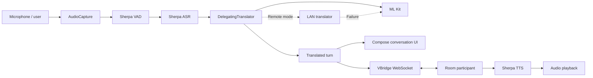
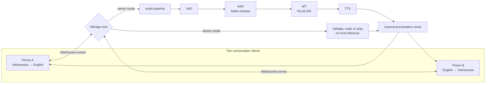
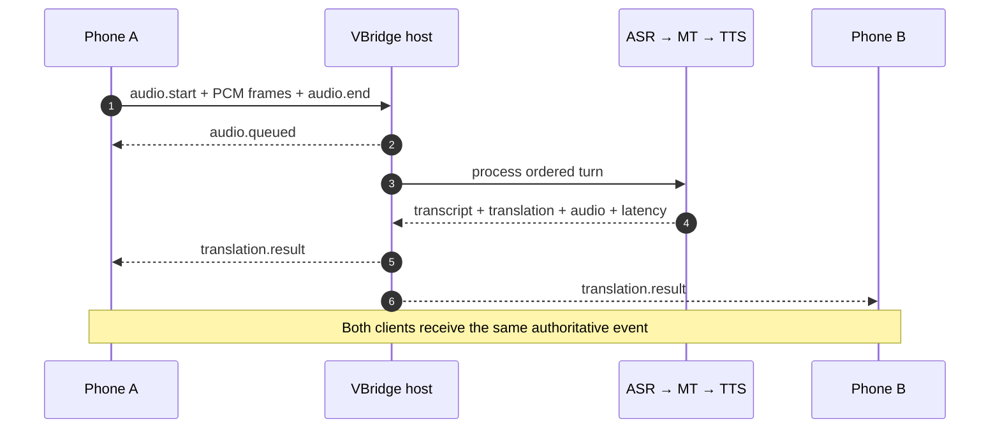
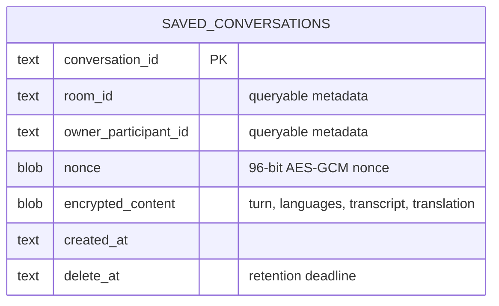
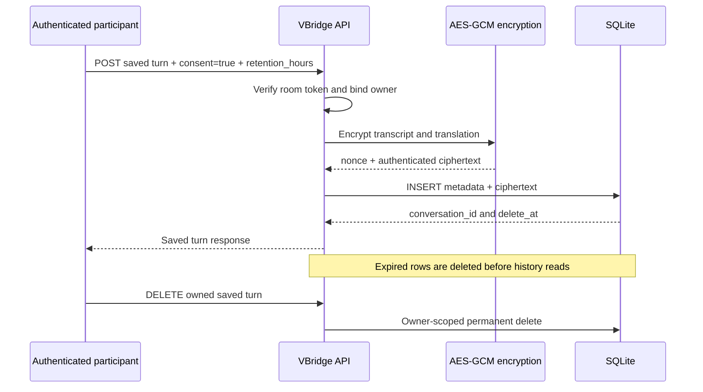

# VBridge

<div align="center">

**A privacy-first, real-time Vietnamese ↔ English meeting interpreter**

Built by **Team SilentVoix** in 48 hours for the
[Vietnam AI Innovation Challenge 2026](https://vietnamaichallenge.com/).

[](https://www.python.org/)
[](https://fastapi.tiangolo.com/)
[](https://react.dev/)
[](https://docs.docker.com/compose/)
[](https://aisingapore.org/)

[How it works](#how-it-works) · [Mobile app](#mobile-app-android) · [Demo runbook](DEMO_RUNBOOK.md) · [API](#api) · [References](#references--acknowledgements)

</div>


VBridge keeps a Vietnamese–English conversation flowing when connectivity is unreliable. The same two-phone experience can run in either of two modes:

- **On-device relay** — each phone performs inference locally; the host only validates and relays results.
- **Server-hosted inference** — phones stream audio to a host running ASR → translation → speech synthesis.

Both paths produce one ordered, authenticated result contract, allowing the system to favor privacy and resilience offline or model capacity online without changing the conversation experience.

> [!NOTE]
> VBridge was created for the 17–19 July 2026 Vietnam AI Innovation Challenge in response to the **Real-Time Vietnamese-English Business Meeting Translator Challenge, sponsored by AI Singapore**. The brief calls for a live, bidirectional, near-real-time meeting translator and offers the winner prize money plus a sponsored 1–2 month visiting researcher experience at AI Singapore's office at Nanyang Technological University.

## What

**VBridge is a two-way Vietnamese ↔ English voice interpreter for live, two-person conversations.** It turns speech into a transcript, translates it, synthesizes the translated speech, and delivers the same ordered result to both participants.

| Mode | Where AI runs | Best when | Host responsibility |
|---|---|---|---|
| **On-device relay** | On each phone | Privacy or unreliable connectivity matters most | Authenticate, validate, order, and relay |
| **Server-hosted inference** | On a local or remote host | More compute and stronger models are available | Run VAD → ASR → MT → TTS and broadcast |

### Product experience

#### Research console

Switch language direction and inference mode, record a turn or stream live audio, then inspect the transcript, translation, synthesized speech, and per-stage latency.


#### Two-phone room

Create a room on one phone, share its six-character code, and join from a second phone with the opposite language direction. The responsive view is designed for push-to-talk conversation.

<p align="center">
  
</p>

## Mobile app (Android)

<div align="center">

[](https://kotlinlang.org/)
[](https://developer.android.com/jetpack/compose)
[](https://developer.android.com/)
[](https://github.com/k2-fsa/sherpa-onnx)

</div>

The two-phone experience ships as a native Android app. **VBridge for Android** is a Vietnamese ↔ English speech interpreter built for fast, natural turn-taking: it runs on-device speech recognition, translation with an automatic fallback, and speech synthesis behind a clear push-to-talk interface — no cloud round-trip required for a working conversation.

> Speak Vietnamese or English, receive the translated text, and let the device speak it aloud for the other person.

The full mobile source lives in this repository under **[`demo/VBridgeDemo/`](demo/VBridgeDemo/)** (Kotlin + Jetpack Compose). Large ONNX model binaries are excluded to keep the repo lean — fetch them with [`app/fetch_models.ps1`](demo/VBridgeDemo/app/fetch_models.ps1). See the [mobile README](demo/VBridgeDemo/README.md) and [beginner guide](demo/VBridgeDemo/app/doc/BEGINNER_GUIDE.md) for full detail.

### What the app does

| Area | Capability |
|---|---|
| Languages | Vietnamese ↔ English |
| Speech recognition | On-device Sherpa-ONNX ASR models for Vietnamese and English |
| Voice activity | Silero VAD through Sherpa-ONNX |
| Translation | ML Kit on-device baseline; optional LAN engine with **automatic fallback** |
| Speech synthesis | On-device Sherpa-ONNX / Piper voices for Vietnamese and English |
| Connectivity | Solo interpreter, WebSocket room relay, or offline Bluetooth pairing |
| Capture | Hold-to-talk and tap-to-toggle modes |
| Floor control | Blocks local capture while a remote turn is being spoken |
| Reliability | Local turns stay successful even if the relay is offline; ML Kit is the guaranteed fallback |

The app runs in **Solo mode** (interpret a face-to-face conversation on one device) or **Room mode** (relay translated turns between two participants), with translation running **on-device** by default and an optional **remote LAN engine** that falls back to ML Kit automatically when the server is unreachable. For the strongest offline demo, use `Solo + Hands-on + On-device`.

### Mobile pipeline



Heavy work stays on `Dispatchers.Default` / `Dispatchers.IO` behind bounded coroutine channels, off the Compose main thread.

### Build and run

From `demo/VBridgeDemo/` (Android Studio with SDK 35, or the command line):

```powershell
# Windows — fetch models first if app/src/main/assets is empty
powershell -ExecutionPolicy Bypass -File .\app\fetch_models.ps1
.\gradlew.bat testDebugUnitTest assembleDebug installDebug
```

```bash
# macOS / Linux
./gradlew testDebugUnitTest assembleDebug installDebug
```

An ARM device (`arm64-v8a` recommended) is best — the packaged Sherpa native libraries may not load on an x86-only emulator. The debug APK lands in `app/build/outputs/apk/debug/`.

## Why

Language access should not disappear with the network, and private conversations should not require sending raw audio to a third-party cloud. VBridge treats offline operation as a reliability and privacy baseline, then adds host inference as an optional quality upgrade.

| Real-world problem | VBridge answer |
|---|---|
| Conversation breaks when the network does | Device mode provides an offline reliability floor |
| Cloud-only speech systems expose sensitive audio | Local inference can keep speech on the phones |
| Small devices cannot always run the strongest models | Host mode unlocks larger ASR and translation models |
| Reconnects and retries can duplicate conversation turns | Signed tokens, event IDs, sequence ordering, and replay-safe results |
| A polished demo can hide pipeline bottlenecks | ASR, MT, TTS, queue, and end-to-end latency are observable |
| Southeast Asian languages are often secondary benchmarks | Vietnamese ↔ English is the primary product path and evaluation target |

## How it works

### Hybrid architecture



### One turn, delivered once



In **device mode**, the phone sends an already-computed `translation.result`; the host skips the pipeline and relays the validated event to both participants.

### Optional encrypted conversation history

Conversation persistence is **off by default**. A participant must explicitly submit
`consent: true` for each turn they choose to save. VBridge stores only an encrypted JSON payload;
room and owner identifiers plus retention timestamps remain queryable so ownership and automatic
deletion can be enforced. Audio is never written to this database.





SQLite indexes support `(owner_participant_id, created_at DESC)` history reads and `delete_at`
retention cleanup. Production requires an independent
`VBRIDGE_CONVERSATION_ENCRYPTION_KEY`; rotating it without re-encryption makes existing records
unreadable. This database is deliberately not used for room coordination, so the API must still run
with one worker until room state moves to shared storage.

### Technology

| Layer | Implementation |
|---|---|
| Web client | React, TypeScript, Vite, Tailwind CSS |
| API and realtime transport | FastAPI, REST, WebSockets |
| Speech recognition | [faster-whisper](https://github.com/SYSTRAN/faster-whisper), default model `Systran/faster-whisper-base` |
| Machine translation | [NLLB-200](https://huggingface.co/facebook/nllb-200-distilled-600M), distilled 600M checkpoint |
| Voice activity detection | [Silero VAD](https://github.com/snakers4/silero-vad) or energy-based fallback |
| Speech synthesis | Pluggable TTS contract; mock implementation included |
| Packaging | Docker Compose; optional CUDA override |
| Quality | pytest, Ruff, TypeScript, ESLint |

### Running the demo

The full operator runbook — Docker Compose stacks (lightweight relay, CPU, and CUDA inference), local development, and the two-phone judging walkthrough — lives in **[DEMO_RUNBOOK.md](DEMO_RUNBOOK.md)** to keep this overview focused.

### API

#### Core pipeline

| Method | Route | Purpose |
|---|---|---|
| `GET` | `/health` | Service health |
| `GET` | `/metrics` | Average stage and total latency |
| `GET` | `/metrics/prometheus` | Prometheus-compatible load and inference metrics |
| `POST` | `/rooms/{room_id}/conversations` | Explicitly save one encrypted translated turn |
| `GET` | `/rooms/{room_id}/conversations` | List the authenticated participant's saved turns |
| `DELETE` | `/rooms/{room_id}/conversations/{conversation_id}` | Permanently delete an owned saved turn |
| `POST` | `/asr` | Speech recognition |
| `POST` | `/translation` | Vietnamese ↔ English translation |
| `POST` | `/tts` | Speech synthesis |
| `POST` | `/pipeline/upload` | Upload and process a complete audio turn |
| `WS` | `/pipeline/stream` | Stream PCM audio and receive partial/final events |

#### Conversation rooms

| Method | Route | Purpose |
|---|---|---|
| `POST` | `/rooms` | Create a two-participant room |
| `POST` | `/rooms/join` | Join with a six-character code |
| `GET` | `/rooms/{room_id}` | Recover authenticated room state |
| `DELETE` | `/rooms/{room_id}` | Close a room as its creator |
| `WS` | `/ws/rooms/{room_id}?token=…` | Exchange ordered room events and audio |

The room protocol guards against duplicate event IDs and out-of-order sequences, supports authenticated reconnection, limits turn size and duration, and queues completed turns without blocking ping or subsequent uploads. Explore the exact schemas in the running [OpenAPI documentation](http://localhost:8000/docs).

### Evaluation

The repository includes repeatable model-selection and robustness tooling rather than presenting a single benchmark as universal performance:

```powershell
pip install -e ".[audio,asr,mt,vad,eval,dev]"
$env:VBRIDGE_ASR_MODE="real"
$env:VBRIDGE_MT_MODE="real"
$env:VBRIDGE_VAD_MODE="silero"
python scripts/eval/run.py --asr-mode real --mt-mode real
```


Results depend on hardware, audio conditions, model checkpoint, and dataset. The checked-in CPU measurements are engineering evidence for model selection and wiring; rerun them on the target deployment before making production claims.

### Project map

```text
VBridge/
├── apps/
│   ├── api/                 # FastAPI application and endpoints
│   ├── web/                 # React research and room clients
│   └── android-pol/         # Android proof-of-concept
├── demo/
│   └── VBridgeDemo/         # Native Android app (Kotlin + Jetpack Compose)
├── services/                # ASR, MT, TTS, VAD, pipeline, room services
├── shared/                  # Contracts, configuration, logging, metrics
├── scripts/                 # Evaluation and demo helpers
├── dataset/                 # Evaluation dialogues and fixtures
├── tests/                   # Unit and integration tests
├── docs/                    # Design notes, requirements, and images
└── docker/                  # API and web container definitions
```

### Quality checks

```bash
ruff check .
pytest
cd apps/web && npm run build && npm run lint
docker compose build
docker compose -f docker-compose.yml -f docker-compose.inference.yml build api
```

## AI Singapore challenge checklist

This checklist follows the supplied **Real-Time Vietnamese-English Business Meeting Translator Challenge** brief. Status reflects what can be demonstrated from this repository today.

### Core requirements

| Status | Requirement from the brief | VBridge answer and demo evidence |
|:---:|---|---|
| ✅ | Functional prototype built during the two-day hackathon | The web app, FastAPI service, Docker deployment, and two-phone room form a working end-to-end prototype. |
| ✅ | Bidirectional Vietnamese ↔ English translation | Each participant selects a speaking direction; the peer uses the opposite direction. Both REST and room contracts carry source and target languages. |
| ✅ | Live, in-person business meeting use | Two phones join a shared room and exchange push-to-talk turns through one live conversation timeline. |
| ✅ | Live free-flow judging demo in both languages | Judges can create/join a room, alternate Vietnamese and English turns, and see identical results on both devices. |
| 🟡 | Strong communication accuracy and low perceived latency | Real ASR/MT modes, per-stage timing, evaluation scripts, and checked-in results exist. Quality must still be demonstrated live on the judging dialogue and hardware. |
| ✅ | Intuitive, efficient, minimally disruptive UX | Six-character join code, explicit language direction, one hold-to-talk control, automatic delivery, and a mobile layout keep interaction lightweight. |
| ✅ | Accessible hardware | Runs on laptops and smartphones through the browser; Docker hosts the inference service on ordinary CPU hardware, with an optional CUDA path. |

Legend: ✅ implemented · 🟡 implemented with live-demo validation still required · ⬜ not yet complete

### Judging rubric

| Criterion | Weight | VBridge response | Evidence to present |
|---|---:|---|---|
| **Translation accuracy** | **30%** | Bidirectional faster-whisper + NLLB pipeline with human-recorded Vietnamese and English business fixtures. | Run `scripts/eval/run.py` in real mode on `vi_business_01.wav` and `en_business_01.wav`; present its WER, BLEU, RTF, model name, backend, and total time. Treat `vbridge_mt_evaluation.csv` as supplementary MT evidence, not a stand-alone score. |
| **Latency and responsiveness** | **20%** | Streaming and complete-turn paths record ASR, MT, TTS, queue, dispatch, and end-to-end timing. | Complete several live turns, then show the result timings and `/metrics`. Report warm-turn measurements from the judging machine and disclose cold model startup separately. |
| **User experience and meeting flow** | **20%** | The two-device room provides six-character pairing, language direction, push-to-talk, speaker-labelled transcripts, and translated text. Synthesized audio is available in the separate Research console. | Let a judge join as the second participant and conduct an alternating conversation without operator intervention; use Research only if audio playback must also be shown. |
| **Robustness in realistic conditions** | **15%** | VAD, bounded turn queues, speaker identity, ordered events, duplicate rejection, and noise-test assets address realistic conversation behavior. | Demo alternating speakers and one controlled-noise turn. Show the ASR noise chart only as preliminary evidence, then report the live outcome; use the automated room tests to demonstrate ordering, duplicate rejection, queueing, and token-based socket replacement. |
| **Technical design and deployability** | **15%** | Modular services, canonical events, authenticated rooms, REST/WebSocket APIs, health checks, metrics, containers, and two inference modes. | Start the stack with Docker, open `/health`, `/metrics`, and `/docs`, then relate the running services to the architecture diagram. State that room state is process-local and currently requires one API worker. |

### Bonus considerations

| Status | Bonus in the brief | VBridge implementation or gap |
|:---:|---|---|
| ✅ | **Open AI models hosted on-premise** | faster-whisper, NLLB-200, and Silero VAD run on the VBridge host; meeting audio does not need a third-party inference API. |
| 🟡 | **Edge-device deployment** | The shared protocol and Android proof-of-concept support the edge architecture. The web device-mode path still uses the server pipeline as a declared stand-in; native quantized inference remains to be completed and benchmarked. |
| 🟡 | **Effective in noisy environments** | The repository includes VAD and ASR robustness experiments across clean, light, medium, and heavy noise. This still needs a repeatable live noisy-room demonstration. |
| ✅ | **Conversational turn-taking** | Participant identity, ordered sequences, duplicate protection, bounded queues, and one authoritative broadcast preserve alternating turns. |
| ✅ | **Extensible to more language pairs, especially lower-resource languages** | Language direction is represented in shared contracts and translation is isolated behind a service interface. Adding a pair does not require redesigning rooms or transport. Model coverage and quality must be evaluated per language. |

### Final live-demo gate

- [ ] Start the real-model stack on the exact judging hardware before the session.
- [ ] Warm model weights and record cold-start versus warm-turn latency.
- [ ] Test at least three Vietnamese → English and three English → Vietnamese business turns.
- [ ] Include names, numbers, dates, and business terminology in the accuracy test.
- [ ] Run alternating speakers without an operator touching the host.
- [ ] Add controlled background noise and confirm VAD and turn completion remain usable.
- [ ] Verify token-based WebSocket replacement with the room API test or a controlled client; do not claim automatic browser reconnection, which is not implemented.
- [ ] Demonstrate that both phones receive the same ordered translation result.
- [ ] Keep the deterministic mock stack ready only as a transport/UI fallback, clearly labelled as mock.
- [ ] State the edge-device limitation accurately; do not present the browser stand-in as native offline inference.

## Roadmap

- Replace the browser device-mode stand-in with quantized native on-device ASR, MT, and TTS.
- Persist rooms, replay state, and queues for safe multi-worker deployment.
- Add speaker diarization, domain glossary controls, and broader Vietnamese accent evaluation.
- Package the Android client and automate two-device end-to-end tests.

## References & acknowledgements

VBridge stands on open research and a regional innovation community:

- [Vietnam AI Innovation Challenge 2026](https://vietnamaichallenge.com/) — official event, award, sponsor, and organizer information.
- [AI Singapore](https://aisingapore.org/) — sponsor of the Real-Time Vietnamese-English Business Meeting Translator Challenge. The supplied brief includes prize money and a sponsored 1–2 month visiting researcher experience at its NTU office for the winning team.
- [SEA-LION](https://sea-lion.ai/) — AI Singapore's open, Southeast Asia–focused language model initiative and a future evaluation candidate; it is not currently an implemented VBridge dependency.
- [National Innovation Center, Vietnam](https://nic.gov.vn/) — co-organizer and home of Vietnam's national innovation ecosystem.
- [AI for Vietnam Foundation](https://aiforvietnam.org/) — challenge co-organizer and builder community.
- [faster-whisper](https://github.com/SYSTRAN/faster-whisper) and the [Whisper paper](https://arxiv.org/abs/2212.04356) — efficient speech recognition and its research foundation.
- [NLLB-200](https://ai.meta.com/research/no-language-left-behind/) and the [NLLB paper](https://arxiv.org/abs/2207.04672) — multilingual machine translation research.
- [Silero VAD](https://github.com/snakers4/silero-vad) — voice activity detection used by the real pipeline.

<div align="center">

Built with care by **Team SilentVoix** · Vietnam ↔ Singapore · 2026

</div>
