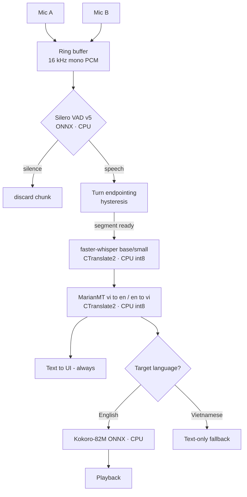
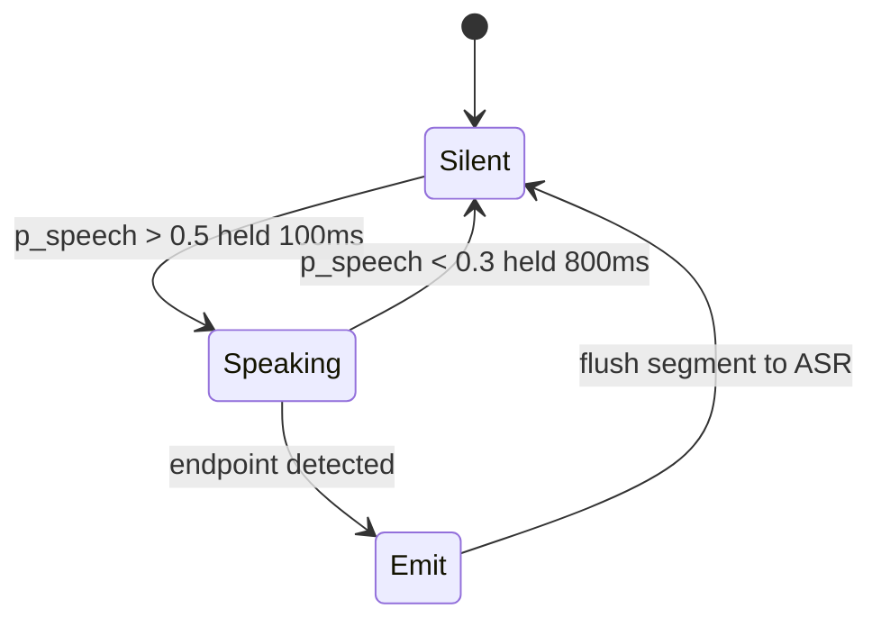

# Engineering Report — Feasibility on the Real Box

**Question:** which key ideas from `vbridge_engineering_report.md` can we actually take on, given the machine we're demoing on?

**The constraint the report ignores:** the report is written for **NVIDIA/CUDA** (`device="cuda"`, `int8_float16`, `nvidia/cuda` image). Our demo machine is an **AMD Ryzen 7 H255 / Radeon 780M** — no CUDA, no usable ROCm on Windows. Every verdict below is scored against **CPU-only inference in 48h, 100% on-device.**

---

## Verdict summary

| Key idea (report §) | Verdict | Why, on our box |
| :--- | :--- | :--- |
| Cascade over E2E (§1) | **Adopt** | Modular, debuggable, CPU-friendly. Report's own choice — correct. |
| Silero VAD v5, ONNX CPU (§2) | **Adopt** | Runs <1% of one core on CPU. No GPU. This is the pick — see below. |
| Turn endpointing hysteresis (§6) | **Adopt** | Pure logic, no model cost. Makes us a conversation, not a sentence app. |
| Dual-channel WebSocket (§6) | **Adopt** | Bypasses diarization entirely at the mic layer. Cheap, robust. |
| Faster-Whisper ASR (§3) | **Adapt** | CTranslate2 has a strong CPU backend — but not `large-v3`. Use `base`/`small` or PhoWhisper-small, `compute_type="int8"`. |
| NLLB-600M / MarianMT (§4) | **Adapt** | Take MarianMT (report's own hackathon pick): ~CPU-fast, tiny. NLLB-600M CPU is the stretch goal. |
| Kokoro-82M EN TTS (§5) | **Adapt** | ONNX CPU, fast, fine for English. |
| MeloTTS Vietnamese (§5) | **Defer / fallback** | VI TTS quality on CPU is the biggest unknown. Ship **text-only VI output** first (challenge allows it). |
| INT8 quantization (§10) | **Adopt** | Mandatory on CPU — but `int8_float16` is a **CUDA** compute type. On CPU use `compute_type="int8"`. |
| `asyncio.to_thread` parallelism (§10) | **Adopt** | *More* critical on CPU — inference is slow, must not block the event loop. |
| Conversation memory + glossary (§6) | **Adapt** | A dict + prompt-side term substitution. Data eng owns it; no model needed. |
| Interruption handling (§6) | **Defer** | Nice, not core. Build after the one-way turn works end-to-end. |

---

## The one key idea to take on now

**The turn-taking core: Silero VAD + hysteresis endpointing + dual-channel mics.**

It is the highest-leverage, lowest-risk idea in the whole report *for our hardware*:

- **CPU-native.** Silero VAD is a tiny ONNX CNN — it does not touch the GPU we don't have.
- **It's the differentiator.** The pitch's whole claim is "not one isolated sentence at a time." Turn-taking is what delivers that. Without it we're a slow Google Translate.
- **It's cheap.** VAD is <1% of a core; endpointing is a state machine with no model cost; dual-channel deletes the diarization problem instead of solving it.
- **It de-risks everything downstream.** VAD gates the expensive CPU models so ASR/MT/TTS only run on real speech — the single most important CPU-budget optimization we have.

Everything heavy (ASR model size, VI TTS) stays a knob we can turn down. The turn-taking core does not — build it first, build it well.

## Adapted pipeline (CPU / AMD 780M)

## Turn endpointing state machine

---

## Two corrections to make before you code

1. **`compute_type`.** The report says `int8_float16` everywhere — that path needs CUDA Tensor cores. On CPU it's `compute_type="int8"` (or `int8` with `cpu_threads` tuned). Wrong value = it won't load.
2. **ASR model size.** `large-v3` at the report's "RTF < 0.12" is a GPU number. On this CPU, `large-v3` will blow the sub-2s budget. Start at `base`, measure real RTF, climb only if there's headroom.

**Bottom line:** yes — take on the turn-taking core. It's the one idea that is simultaneously CPU-feasible, on the critical path for the pitch, and cheap. The models are adaptable knobs around it. This is tracked against the compute-path decision in issue #1.
